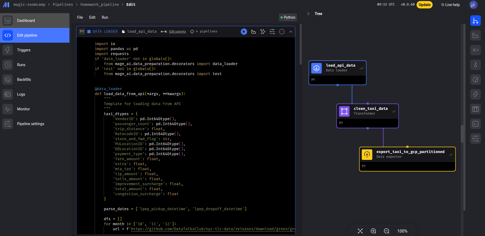
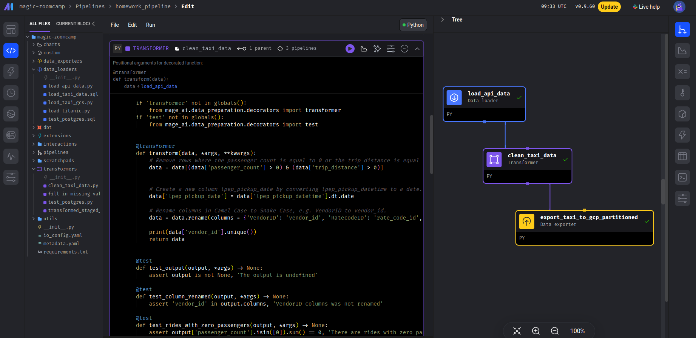
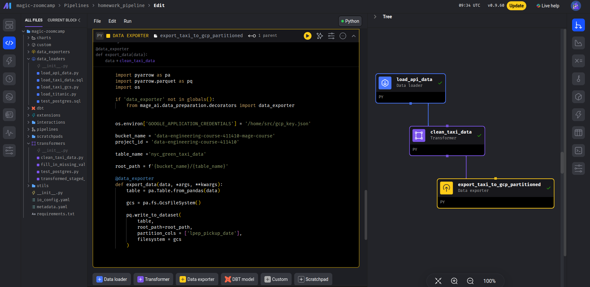

## Question 1. Data Loading
Once the dataset is loaded, what's the shape of the data?
Answer 266,855 rows x 20 columns

## Question 2. Data Transformation
Upon filtering the dataset where the passenger count is equal to 0 or the trip distance is equal to zero, how many rows are left?
Answer: 139,370 rows

## Question 3. Data Transformation
Which of the following creates a new column lpep_pickup_date by converting lpep_pickup_datetime to a date?
Answer : data['lpep_pickup_date'] = data['lpep_pickup_datetime'].dt.date

## Question 4. Data Transformation
What are the existing values of VendorID in the dataset?
Answer: 1 or 2

## Question 5. Data Transformation
How many columns need to be renamed to snake case?
Answer: 4

## Question 6. Data Exporting
Once exported, how many partitions (folders) are present in Google Cloud?
Answer: 96

## Code:

