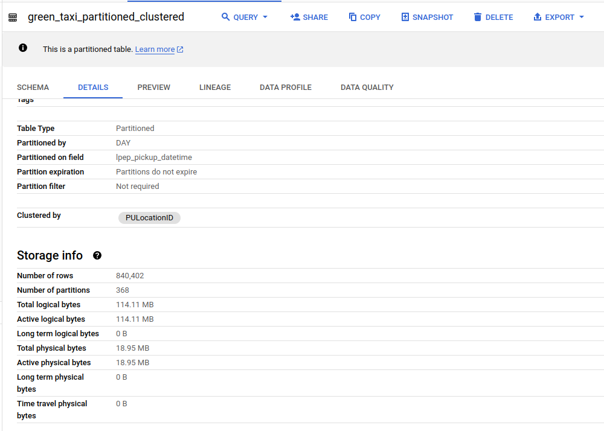

# Week 2: Data warehouse

## BigQuery:

Load data from google cloud storage to BigQuery:

Tables:
- external tables
- normal tables
- partitioned and clustered tables

Run some simple queries
Check homework.sql to see the code

#### Results:

