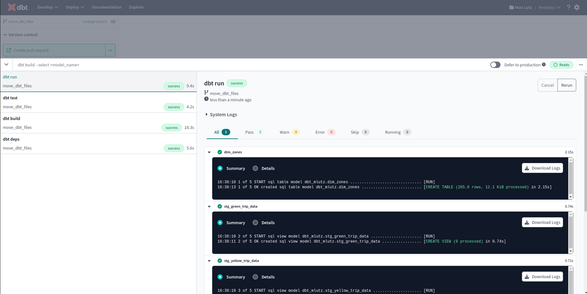
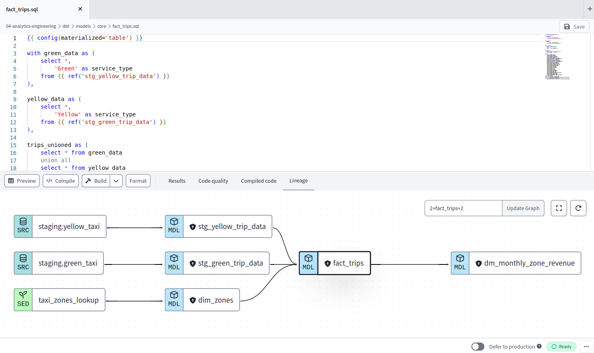
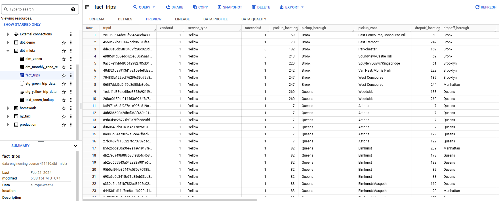

# Week 4: Analytics engineering - dbt

## dbt:

Deploy analytics code following software engineering best practices like modularity, portability, CI/CD and documentation.

It has become the industry standard for data transformation.

dbt allows you to develop and apply the trasnformation inside the data warehouse to go from raw data to optimized format ready for consumption.

What I learned:
- Setting up dbt cloud account and connecting my dbt project to my data warehouse in google cloud (BigQuery)
- Creating bdt staging and core (production) data models
- Understanding data lineage, tests and where to see compiled code in dbt
- Implementing tests that help detect anomalies when running the data models

All the code can be found in the dbt folder.

#### Results - dbt run:

#### Results - data lineage:

#### Results - fact table in bigquery:

